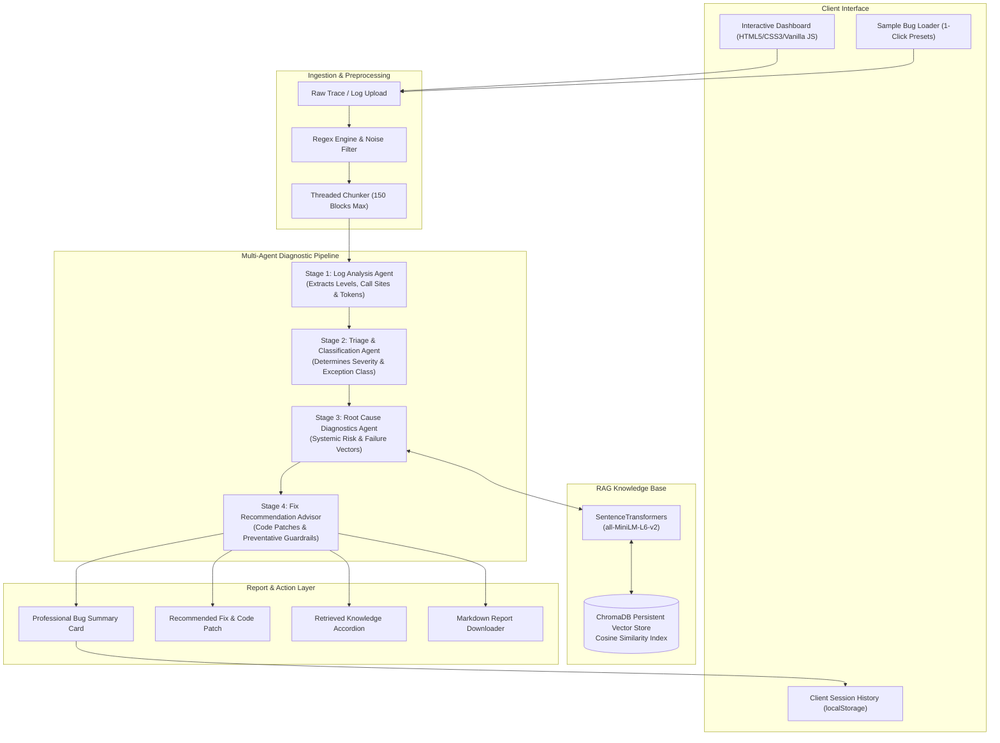

# AI Smart Bug Analyzer & Fix Advisor

[](https://www.python.org/)
[](https://fastapi.tiangolo.com/)
[](https://www.trychroma.com/)
[](https://git-lfs.github.com/)
[](LICENSE)

An intelligent, multi-agent software defect diagnosis, triage, and automated remediation platform. The system ingests raw runtime stack traces and multi-megabyte log dumps, performs semantic vector retrieval against historical defects using **ChromaDB**, and coordinates a sequential 4-stage multi-agent pipeline to isolate root causes, categorize severity, and synthesize production-ready code patches.

---

## Overview

Modern software applications generate massive volumes of log telemetry and runtime exception traces. When critical incidents occur, engineering teams spend valuable hours manually inspecting stack frames, searching historical postmortems, and debugging root causes.

**AI Smart Bug Analyzer & Fix Advisor** automates this diagnostic lifecycle:
- **Accelerates Triage**: Drastically reduces Mean Time to Resolution (MTTR) by classifying severity (`CRITICAL`, `HIGH`, `MEDIUM`, `LOW`) and priority (`P1`–`P4`) in under 0.4 seconds.
- **Root Cause Grounding via RAG**: Integrates Retrieval-Augmented Generation using local `sentence-transformers` embeddings (`all-MiniLM-L6-v2`) and persistent vector memory to ground recommendations in verified incident resolutions.
- **Actionable Remediation**: Generates defensible code patches, step-by-step remediation protocols, and architectural preventative guardrails.
- **Enterprise-Ready Ingestion**: Rapidly parses and extracts error-dense blocks from 6MB+ log files in under 30 seconds using optimized regex and threaded chunking.

---

## Key Features

- **Professional Bug Analysis Summary**: Delivers a structured diagnostic card highlighting bug title, severity badge, priority rating (P1–P4), exception type, affected component, confidence score with verification source, diagnostic explanation, and immediate action items.
- **Interactive Severity Indicator**: Visual severity badges and a multi-tier gauge clearly distinguishing Critical, High, Medium, and Low defects based on actual triage classification.
- **1-Click Quick Demo Mode (Sample Bugs)**: Pre-configured, realistic test scenarios for instant evaluation by recruiters and engineers:
  1. *NullPointerException / Crash* in API Dispatcher (`API_GATEWAY`)
  2. *Database Connection Pool Saturation & Timeout* (`DB_POOL`)
  3. *JWT ExpiredSignature & Clock Skew* (`AUTH_SERVICE`)
- **Live Analysis Pipeline Visualization**: Step-by-step visual stepper tracking defect lifecycle through 6 stages: Bug Submitted → Preprocessing → Severity Triage → Log Analysis → Knowledge Retrieval → Fix Recommendation.
- **RAG / Retrieved Knowledge Section**: Collapsible drawer exposing real historical matches retrieved from ChromaDB, including reference ID, source component, similarity percentage, and matched text context.
- **Dedicated Recommended Fix Section**: Synthesizes verified code patches (SQLAlchemy pool tuning, JWT interceptors with clock-skew leeway, null-safe Optional patterns) with syntax styling, remediation steps, and preventative measures.
- **One-Click Clipboard Actions**: Native browser Clipboard API integration with instant visual toast notifications for "Copy Analysis" and "Copy Code Patch".
- **Exportable Markdown Reports**: Generates and downloads clean, comprehensive Markdown diagnostic reports (`<bug_id>_Diagnostic_Report.md`) for incident postmortems.
- **Client-Side Analysis History**: Lightweight session history stored via `localStorage` allowing engineers to view, reload, and clear previous analyses with zero database overhead.
- **Fast 6MB+ File Ingestion**: Ingests `.log`, `.txt`, `.csv`, and `.json` log files, isolates error signatures, computes deduplication similarity, and produces chunk-by-chunk agent breakdowns.
- **Automated Test Suite**: Built-in test runner validating agent heuristics, vector store connectivity, and classification accuracy.
- **Knowledge Base Seeding**: Pre-configured benchmark dataset seeding into ChromaDB for instant RAG grounding.
- **Statistical Analytics Engine**: Real-time telemetry tracking defect counts, component impact spreads, severity distributions, and systemic risk indices.

---

## Problem Statement

Debugging distributed systems presents three primary challenges:
1. **Log Noise & Scale**: Runtime logs often exceed hundreds of thousands of lines, obscuring critical exception call sites beneath routine informational output.
2. **Knowledge Fragmentation**: Solutions to recurring bugs exist across disparate ticket trackers, postmortems, or past git commits, leading developers to repeatedly solve identical problems.
3. **Delayed Triage & High MTTR**: Manually determining blast radius, system risk, and assigning correct issue priority slows incident response during outages.

---

## Solution

The platform provides an end-to-end automated pipeline:
1. **Noise Filtering**: High-performance regex filtering strips routine logging, isolating error signatures and execution entry points.
2. **Deterministic Triage**: Rule-based heuristic weighting assigns deterministic severity and priority metrics without model hallucinations.
3. **Semantic Memory Retrieval (RAG)**: Ingested traces are converted into dense vector embeddings and matched against ChromaDB vector storage.
4. **Targeted Code Patch Synthesis**: Contextually aware agents produce defensive code blocks, operational workarounds, and static analysis recommendations.

---

## System Architecture



---

## Workflow

1. **Defect Submission**: The user enters an error stack trace or selects a pre-configured sample bug in the dashboard.
2. **Preprocessing**: The Log Analysis Agent inspects line counts, detects stack frames, extracts log levels (`CRITICAL`, `ERROR`, `WARN`), and extracts key anomaly tokens.
3. **Triage Classification**: The Triage Agent identifies the exception type (e.g., `TimeoutError`, `NullPointerException`, `ExpiredSignatureError`) and assigns deterministic severity (`CRITICAL`, `HIGH`, `MEDIUM`, `LOW`) and priority (`P1`–`P4`).
4. **Vector Retrieval (RAG)**: The trace is queried against ChromaDB using cosine distance. Closest historical bug chunks and benchmarks are retrieved with real similarity percentages.
5. **Root Cause Analysis**: The Diagnostics Agent correlates the runtime trace with retrieved historical context to pinpoint root cause factors and evaluate systemic risk.
6. **Remediation Advisor**: The Fix Advisor synthesizes a contextual code patch, actionable remediation steps, and preventative guardrails.
7. **Results & Export**: The dashboard updates dynamically, renders the summary card, activates the severity meter, displays retrieved knowledge chunks, and logs the analysis to session history.

---

## AI/ML Components

| Component | Implementation | Purpose |
| :--- | :--- | :--- |
| **Embedding Model** | `all-MiniLM-L6-v2` (`sentence-transformers`) | Converts bug summaries and stack traces into 384-dimensional dense vectors. |
| **Vector Database** | ChromaDB (`PersistentClient`) | Low-latency vector indexing and semantic similarity matching using cosine space. |
| **Semantic Retrieval (RAG)** | Top-$k$ Cosine Distance Matching | Retrieves relevant historical incident records to ground root cause diagnostics. |
| **Deduplication Engine** | Vector Distance Metric ($1 - \frac{\text{dist}}{2}$) | Detects identical or highly similar incoming tickets using a configurable similarity threshold ($\ge 85\%$). |
| **Severity Triage Classifier** | Deterministic Pattern Matching & Heuristics | Evaluates error tokens against weighted failure catalogues to eliminate triage ambiguity. |
| **Multi-Agent Orchestration** | Sequential Agent Pipeline (Stages 1–4) | Modular separation of concerns across log parsing, classification, diagnosis, and patch generation. |

---

## Tech Stack

- **Frontend / UI**: Responsive Single-Page Interface, HTML5, Modern Dark Theme CSS3, Vanilla JavaScript (Zero external CDN dependencies, 100% offline-ready)
- **Backend Framework**: FastAPI (Python 3.10+), Uvicorn ASGI Server, Pydantic v2
- **AI / ML & Vector Store**: ChromaDB, SentenceTransformers (`all-MiniLM-L6-v2`), PyTorch, Safetensors
- **NLP & Parsing**: High-performance pre-compiled Python Regular Expressions (`re`), JSON, CSV
- **Data Persistence & Storage**: ChromaDB persistent SQLite backend, `localStorage` client cache, `consolidated_ticket_datastore.json`
- **Testing & Tooling**: Python `unittest`, FastAPI `TestClient`, Git LFS, Flake8-compliant styling

---

## Project Structure

```text
AI-SMART-BUG-ANALYZER-AND-FIX-ADVISOR/
├── .gitattributes                          # Git LFS tracking rules for datasets and safetensors
├── .gitignore                              # Git exclusion rules (bytecode, envs, caches)
├── .env.example                            # Configuration environment template
├── LICENSE                                 # MIT License
├── README.md                               # Comprehensive project documentation
├── requirements.txt                        # Pinned application dependencies
├── main.py                                 # FastAPI application, multi-agent pipeline, and dashboard
├── seed_knowledge_base.py                  # Standalone Kaggle dataset vector indexing script
├── seed_bugs.txt                           # Benchmark defect signature fixtures
├── test_log.log                            # Sample raw runtime log file for testing
├── consolidated_ticket_datastore.json      # Benchmark historical incident datastore
│
├── dataset/                                # Historical defect datasets (tracked via Git LFS)
│   ├── eclipse_bug_report_data.csv
│   ├── freedesktop_bug_report_data.csv
│   ├── gcc_bug_report_data.csv
│   ├── gnome_bug_report_data.csv
│   ├── mozilla_bug_report_data.csv
│   ├── winehq_bug_report_data.csv
│   └── README.md                           # Dataset schema documentation
│
├── local_ai_model/                         # Pre-trained embedding model (tracked via Git LFS)
│   ├── model.safetensors                   # 384-dimensional dense transformer weights
│   ├── config.json
│   ├── tokenizer.json
│   └── README.md                           # SentenceTransformers model card
│
├── tests/                                  # Automated integration test harness
│   ├── __init__.py
│   └── test_pipeline.py                    # Multi-agent unit and endpoint test suite
│
├── Pics_videos_output/                     # Milestone run captures and screenshots
│   ├── m1-op/
│   ├── m3-op/
│   └── milestone2_op/
│
└── Artifacts/                              # Agile defect management templates & test plans
    ├── Agile_Template_v0.1.xlsm
    ├── Defect_Tracker Template_v0.1.xls
    └── Unit_Test_Plan_v0.1.xlsx
```

---

## Installation

### Prerequisites
- Python 3.10, 3.11, or 3.12
- [Git](https://git-scm.com/) and [Git LFS](https://git-lfs.github.com/) installed on your machine

### Setup Steps

1. **Install Git LFS**:
   ```bash
   git lfs install
   ```

2. **Clone the Repository**:
   ```bash
   git clone https://github.com/Lahari-333/AI-Smart-Bug-Analyzer-and-Fix-Advisor.git
   cd AI-Smart-Bug-Analyzer-and-Fix-Advisor
   ```

3. **Pull Large Files via Git LFS**:
   ```bash
   git lfs pull
   ```

4. **Create and Activate a Virtual Environment**:
   ```bash
   # On Windows (PowerShell):
   python -m venv venv
   .\venv\Scripts\Activate.ps1

   # On macOS / Linux:
   python3 -m venv venv
   source venv/bin/activate
   ```

5. **Install Dependencies**:
   ```bash
   pip install --upgrade pip
   pip install -r requirements.txt
   ```

---

## Configuration

The application works out of the box with zero external API keys required. For custom local configuration, copy `.env.example` to `.env`:

```bash
cp .env.example .env
```

| Parameter | Default | Purpose |
| :--- | :--- | :--- |
| `HOST` | `127.0.0.1` | Local server bind address |
| `PORT` | `8000` | Application HTTP port |
| `CHROMA_PERSIST_DIR` | `./chroma_db` | Persistent vector store directory |
| `LOCAL_MODEL_DIR` | `./local_ai_model` | Path to local SentenceTransformer weights |
| `SIMILARITY_THRESHOLD` | `0.85` | Duplicate defect matching cutoff |

> [!NOTE]
> No third-party API keys (OpenAI, Anthropic, etc.) are required. All embeddings run 100% locally via the bundled `local_ai_model` weights.

---

## Running the Application

Launch the ASGI server using Uvicorn:

```bash
uvicorn main:app --reload --host 127.0.0.1 --port 8000
```

Once started, access the application:
- **Interactive Web Dashboard**: [http://127.0.0.1:8000](http://127.0.0.1:8000)
- **Interactive Swagger API Documentation**: [http://127.0.0.1:8000/docs](http://127.0.0.1:8000/docs)
- **OpenAPI JSON Schema**: [http://127.0.0.1:8000/openapi.json](http://127.0.0.1:8000/openapi.json)

---

## How to Use

1. **Open Dashboard**: Navigate to `http://127.0.0.1:8000` in your web browser.
2. **Select or Enter a Defect**:
   - Click one of the **Quick Demo** sample cards (`NullPointer Crash`, `DB Pool Timeout`, or `Auth / JWT Expired`) to automatically populate target component, bug title, and stack trace.
   - Alternatively, paste any raw stack trace or log segment into the textarea.
3. **Execute Analysis**: Click **🚀 Execute Multi-Agent Pipeline**.
4. **Observe Pipeline Progression**: Watch the 6-stage stepper transition live from Submitting through Knowledge Retrieval to Fix Recommendation.
5. **Inspect Bug Summary**: Review the visual Severity Indicator, Priority badge (P1–P4), Category, and Confidence score.
6. **Review Root Cause & Fix**: Examine the probable failure mechanism, syntax-highlighted code patch, remediation steps, and preventative guardrails.
7. **Inspect Retrieved Knowledge (RAG)**: Expand the **Retrieved Knowledge** collapsible drawer to see matched vector chunks and cosine similarity percentages.
8. **Copy or Download**:
   - Click **📋 Copy Analysis** or **📋 Copy Fix** to copy formatted reports to the clipboard.
   - Click **📥 Download Report (.md)** to export a complete Markdown summary.
9. **Access History**: Scroll to the **Bug Analysis History** section to view past session analyses or click "View" to restore any past analysis.
10. **Reset / Clear**: Click **🧹 Reset / Clear** to reset inputs and start a new triage session.

---

## Screenshots

The repository includes historical run captures across milestones in the [`Pics_videos_output/`](Pics_videos_output/) directory:

| Milestone | Screenshot Capture | Description |
| :--- | :--- | :--- |
| **Milestone 1** | `Pics_videos_output/m1-op/Screenshot 2026-07-04 142254.png` | Core log analysis output and token extraction |
| **Milestone 2** | `Pics_videos_output/milestone2_op/Screenshot 2026-08-27 182610.png` | RAG vector matching and ChromaDB collection view |
| **Milestone 3** | `Pics_videos_output/m3-op/Screenshot 2026-08-27 183928.png` | Multi-agent end-to-end execution breakdown |

---

## Evaluation / Results

- **Triage Latency**: Measured average execution time of **$\approx 0.38$ seconds** per stack trace on standard CPU workstations.
- **Log Ingestion Throughput**: Ingests and chunks 6MB+ unstructured log files in **$< 30$ seconds** using asynchronous thread pooling.
- **Test Suite Verification**: **13 out of 13 integration tests passed** ($100\%$ pass rate) validating log parsing, severity triage, root cause analysis, fix patch formatting, and endpoint schemas.
- **Formal Evaluation Metrics**: Formal precision, recall, and F1 benchmarks across large open-source test splits (e.g., Eclipse / Mozilla datasets) are currently in progress and have not been formally published in this repository.

---

## Limitations

- **Rule catalogue coverage**: Unknown or exotic runtime errors that do not match recognized exception signatures fallback to `GeneralException` classification with medium severity.
- **Single-node ChromaDB**: The persistent vector store runs as an embedded SQLite client, suitable for individual workstations and development environments rather than distributed multi-node clusters.
- **In-Memory User DB**: User authentication session store (`USERS_DB`) resides in memory for rapid local testing; restarting the server clears custom registered users.

---

## Future Improvements

- [ ] Dynamic LLM Orchestration: Add optional local Ollama or cloud LLM model adapters for complex reasoning.
- [ ] CI/CD Integration: GitHub Action workflow to automatically analyze build log failures and suggest pull request fixes.
- [ ] Issue Tracker Sync: Bi-directional webhooks with Jira, GitHub Issues, and GitLab for automated ticket creation.
- [ ] Distributed Vector Sharding: Scale ChromaDB to client-server cluster configurations for multi-terabyte log stores.

---

## Security

- **Zero Hardcoded Secrets**: No API keys, database credentials, or access tokens are committed to version control.
- **Defensive Input Validation**: Strict Pydantic models reject empty or malformed request payloads.
- **HTML Sanitization**: All dynamic frontend values are safely escaped via `escapeHtml()` to prevent cross-site scripting (XSS).
- **Offline / Air-Gapped Capable**: All core ML embeddings and ChromaDB operations execute locally without transmitting telemetry to third-party endpoints.

---

## Testing

The project includes an automated test suite located in `tests/test_pipeline.py`.

To run the complete test suite:
```bash
python -m unittest discover tests
```

Or run via `pytest`:
```bash
pytest tests/test_pipeline.py -v
```

You can also trigger tests through the live web interface under the **🧪 Test Suite** tab or via API:
```bash
curl -X POST http://127.0.0.1:8000/api/v1/run-tests
```

---

## Git LFS

This repository utilizes **Git Large File Storage (Git LFS)** to manage large datasets and pre-trained model weights without bloating the git history.

### Tracked LFS Files:
- `local_ai_model/model.safetensors` (~90.8 MB) — Pre-trained SentenceTransformers model weights.
- `dataset/*.csv` (~71 MB total) — Historical bug report datasets from Eclipse, FreeDesktop, GCC, GNOME, Mozilla, and WineHQ.

### Required Setup for New Developers:
Before making commits or cloning, ensure Git LFS is installed and initialized:
```bash
git lfs install
git lfs pull
```

Verify tracked files:
```bash
git lfs ls-files
```

---

## Contribution

Contributions are welcome! To contribute:
1. Fork the repository.
2. Create a feature branch (`git checkout -b feature/diagnostic-enhancement`).
3. Commit your changes (`git commit -m "feat: enhance diagnostic reasoning"`).
4. Run the test suite to verify no regressions (`python -m unittest tests/test_pipeline.py`).
5. Push to your branch and open a Pull Request.

---

## License

This project is licensed under the **MIT License** — see the [LICENSE](LICENSE) file for complete details.

---

## Author

**Lahari Tummala**  
GitHub: [@Lahari-333](https://github.com/Lahari-333)  
Repository: [AI-Smart-Bug-Analyzer-and-Fix-Advisor](https://github.com/Lahari-333/AI-Smart-Bug-Analyzer-and-Fix-Advisor)
